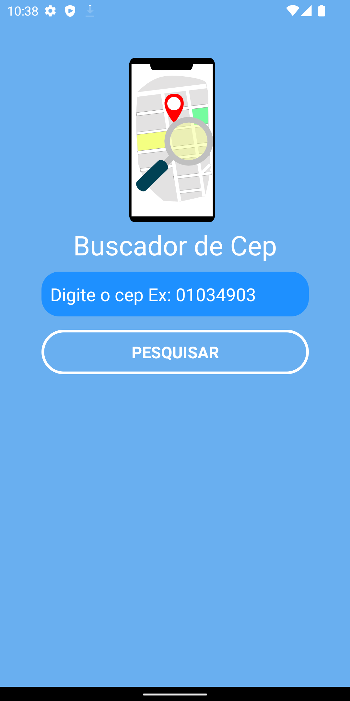
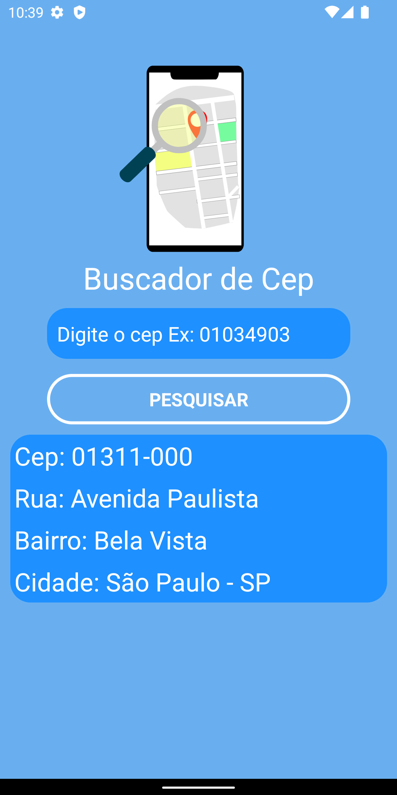
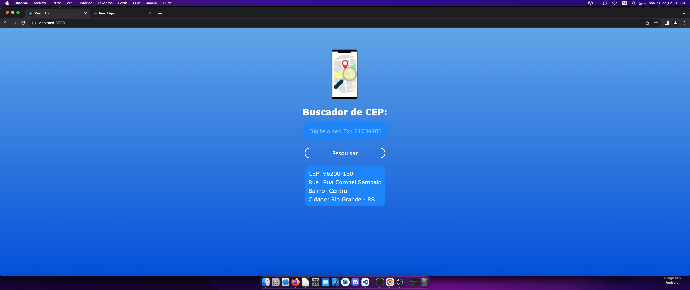
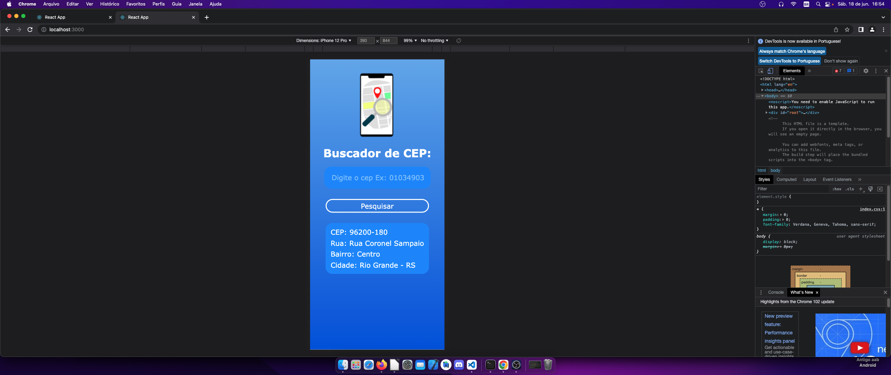

# Buscador de cep
:bulb: Portfolio Buscador de cep com animação em Json

# Objetivo

Tem a função de achar o endereço completo quando o usuário digitar algum cep válido para todo o Brasil.
Podem ser usado por empresas de transporte e entregas de produtos para confirmar o cep e o endereço, em caso de erros de digitação ou para confirmar o endereço cadastrado.

# React Native:

Imagens do aplicativo mobile: 
Clique na imagem para ampliar.

  
  

  

Clique no video abaixo para demonstração do aplicativo mobile com React Native:

  

# React JS:

Imagens do aplicativo web: 
Clique na imagem para ampliar.

  

  Web responsivo:

  

Clique no video abaixo para demonstração da aplicação web com React JS:

  

<!--  -->
